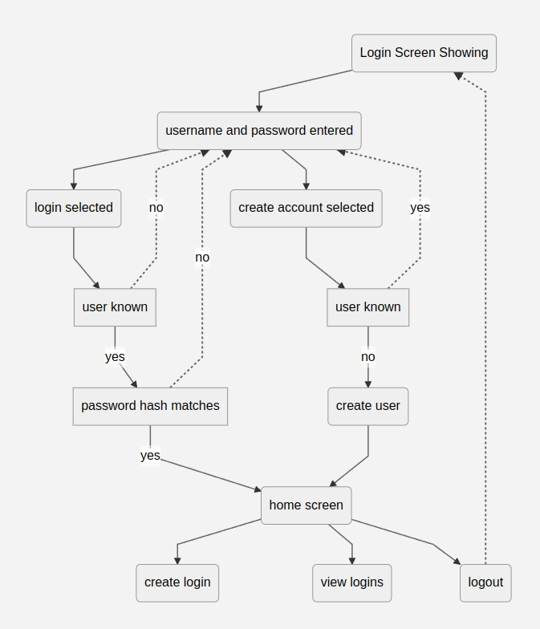
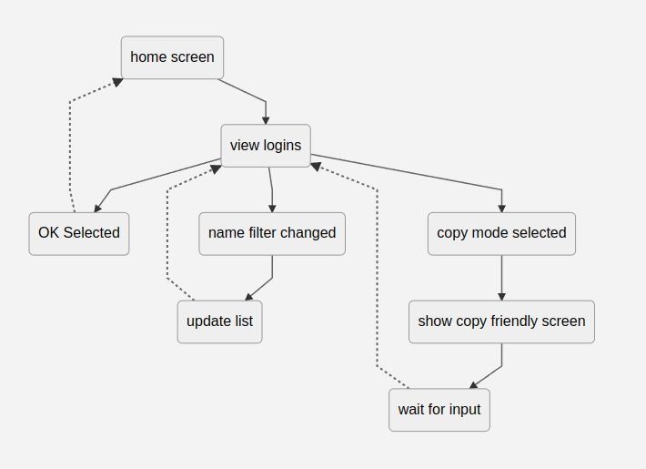

# Passcodes - simple password manager

[Live Link](https://passcodes-993cec8b97da.herokuapp.com/)

## Description
Passcodes is a very simple password manager written in Python. Each record consists of a name, username, password, and URL. 

## Features
* Secure login 
    * User accounts are created and associated with passwords that are hashed and salted.  Plaintext passwords are never stored.  
* Create Login records
    * Users can create records for each login they want to store.  Each record consists of a name, username, password, and URL.
* Random Password generation
    * Users can generate a random password of a specified length.  
    * Options exist to include numbers or special symbols in the password.
* Safe password storage
    * Passwords are encrypted using the Fernet encryption scheme.  The encryption key is the users main password, which is not stored in the database.  
* Dynamic Search
    * Users can search for records by name. The search is dynamic, so results are updated as the user types.
* Copy mode 
    * The filtered records can be printed to screen in a way that enables users to copy information they may want.  This is useful for copying passwords to the clipboard.

## Technologies and Frameworks used
* VSCode - IDE used for development
* Python
    * npyscreen - for creating the terminal user interface (TUI)
    * cryptography - for encrypting and decrypting passwords
* Github - for version control
* Heroku - for deployment

## Logic Flow

### Login flowchart

### Create record flowchart

### View records flowchart

## Login in flow
~~~mermaid
graph TD
a(Login Screen Showing)
b(username and password entered)
c(login selected)
d(create account selected)
e[user known]
f[password hash matches]
g(home screen)
h[user known]
i(create user)

a-->b-->c & d
c --> e
e --yes--> f --yes--> g
e & f -. no .-> b
d-->h
h -.yes.-> b
h --no--> i --> g
g --> c1(create login) & vl(view logins) & lo(logout)
lo -.-> a
~~~

## Create Entry flowchart
~~~mermaid
graph TD
hs(home screen)-->cl(create login screen)
cl-->pl(password length changed)-->g(generate new password)-.->cl
cl-->o1(password options changed)-->g
cl-->ok(OK selected)-->ar(add record to database)-.->hs
cl-->cn(cancel selected)-.->hs
~~~

## View entries flowchart
~~~mermaid
flowchart TD
hs(home screen)-->vl(view logins)

vl-->ok(OK Selected)-.->hs
vl-->nc(name filter changed)-->up(update list)-.->vl
vl-->cm(copy mode selected)-->sc(show copy friendly screen)-->sc2(wait for input)-.->vl
~~~
