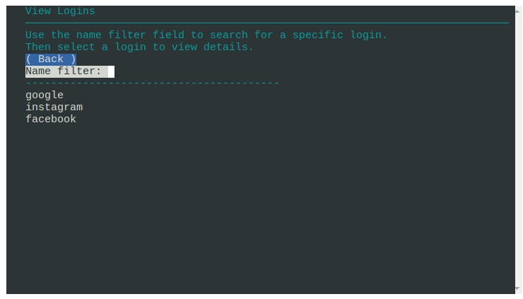
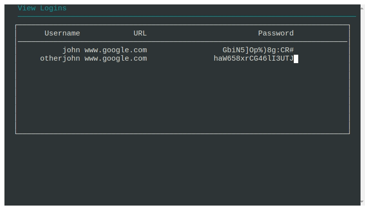

# Passcodes - simple password manager

[Live Link](https://passcodes-993cec8b97da.herokuapp.com/)

## Description
Passcodes is a very simple password manager written in Python. Each record consists of a name, username, password, and URL. 

## Features
* __Secure login__
    * User accounts are created and associated with passwords that are hashed and salted.  Plaintext passwords are not stored.
    
    

* __Create Login records__
    * Users can create records for each login they want to store.  Each record consists of a name, username, password, and URL.
    
    

* __Random Password generation__
    * Users can generate a random password of a specified length.  
    * Options exist to include numbers or special symbols in the password.

* __Safe password storage__
    * Passwords are encrypted using the Fernet encryption scheme.  The encryption key is the users main password, which is not stored in the database.  

* __Dynamic Search by name__
    * Users can search for records by name. The search is dynamic, so results are updated as the user types.

    

* __Details of each record__
    * Users can view the details of each record.  The details include the name, username, password, and URL.  The password is decrypted using the users master password.

    

* __Multiple records for each name__
    * Multiple records can exist for each name.  This allows the user to store a history of records for each name.

* __User Account Management__ 
    * Users can change their master password, or delete their account.  The master password is required to change the password or delete the account.

    

* __User Alerts for input errors__
    * Users are alerted if they enter an invalid inputs.  This includes invalid blank entries, wrong passwords, and duplicate usernames.

    

* __Confirmation dialog for user actions__
    * Users are asked to confirm before executing certain actions, such as changing passwords or deleting user accounts. 

* __PostgreSQL database__
    * The database is PostgreSQL, which is a relational database. 

## Cryptographic Security
### Primary User Passwords
The primary user passwords, or master passwords are not stored in the database.  Each password is assigned a salt value, and the password plus the salt value are hashed using the SHA256 algorithm.  

The salt value is stored in the database, and the hashed password is stored in the database.  

~~~mermaid
    graph TD
    mp(master password)
    sp(salt)
    db[(database)]
    hp[/hashed password/]

    subgraph User Record
        hp
        sp
        un(username)
    end

    mp & sp --> hp
    hp & un & sp --> db
~~~

When a user attempts to login, the salt value is retrieved from the database, and the password entered by the user is hashed using the same salt value.  

If the hashed password matches the hashed password in the database, the user is logged in.  If the hashed passwords do not match, the user is not logged in.

### Login Passwords
The passwords for each login record are encrypted using the Fernet encryption scheme.  The encryption key is the users master password.  

The master password is not stored in the database, so the login passwords cannot be decrypted without the master password.

~~~mermaid
    graph LR
    mp(master password) & lp(login password) --> e[/encrypted password/]
    db[(Database)]
    subgraph login record
        e
        n1(name) & n2(username) & url(URL)
    end
    e & n1 & n2 & url --> db
~~~

### Cryptographic Functions

The application uses the standard python __cryptography__ module for symmetric cryptography.  The __Fernet__ class is used to encrypt and decrypt the login passwords.  The __SHA256__ algorithm is used to hash the master passwords.

There are three cryptographic functions that are defined in __helpers.py__.  These functions are:
* __hash()__ - generates hashes using the SHA256 algorithm
* __encrypt()__ - encrypts plaintext using the Fernet class
* __decrypt()__ - decrypts cyphertext using the Fernet class

If the encryption scheme needs to be changed in the future, only these functions need to be changed.

## Interface Flowchart

### Login to the app

There are two ways to get to the home screen.  The first is to create a new account.  The second is to login to an existing account.  

There are logical requirements for each.  To create a new account the username __must not__ already exist in the database.  

To login to an existing account the username __must__ exist in the database, and the password __must match__ the hashed password in the database.

Also, neither the username or password field can be blank. 

If any of the conditions here are not met, a corresponding alert is presented to the user.

___The graph below shows the general flowchart for user interaction.___

~~~mermaid
flowchart TD

classDef formview fill:#f96

class hs formview;

cr2-->hs
pw1-.->|yes|hs
hs[[Home Screen]]-->Create_Entry
hs-->View_Entries
hs-->Account_Details

subgraph "Login_Screen"
    lf[[Login Form]]-->de(username and password entry)-->lp(Login) & cr1(Create Account)
    lp-->uk1(username is known)-.->|Yes|pw1(password hash matches)
    cr1-->uk2(username is known)-.->|No|cr2[(Add Account to Database)]
    
end

subgraph Create_Entry
    crf[[Create Entry Form]]-->de2(Entry Details)-->nv(name is valid)
    nv-.->|Yes|cr3[(Add Entry to Database)]
end

subgraph View_Entries
    vef[[View Entries Form]]
    vef-->ns(name selected)
    vef-->nf(names filtered)-->ul(update list)
    ns-->ed[[entry details view]]
end

subgraph Account_Details
    chpw[[Account Details Form]]
    chpw-->de3(Change Password) & de4(Delete Account)
    de3-->cpw1(Password is correct)-.->|Yes|cpw2[(Change Password)]
    de4-->cpw4(Password is correct)-.->|Yes|cpw3[(Delete Account)]
end
~~~

___Note___: Dashed lines represent logical requirements.  Failures to meet these requirements will result in an alert presented to the user.  

### Creating Entries
To create a new entry the user fills in the name of the record, along with a username, password and URL field.  The name field is required, but the other fields are optional.

The password is randomly generated, but the user can edit it if they want.  In addition, there is a button to regenerate the password, as well as controls to set the password length, and to include numbers and special characters in the password.

The only requirement for entries is that the name field must not be blank.  If the name field is blank, an alert is presented to the user.

Multiple records with the same name are allowed, and they will not overwrite each other.  This allows the user to store a history of records for each name.

### Viewing Entries

The view entries form shows a list of records.  This list can be filtered dynamically by the user by typing in the name filter field.  The list is updated as the user types.

The user can select a record by clicking on it, or by using the up and down arrow keys.  The details of the selected record are shown in the details view.

## Interface classes

~~~mermaid 
graph LR
    stui[simpleTuiApp]
    stui-->f1[form 1]
    stui-->f2[form 2]
    stui-->f3[form 3]
    f1-->w1[Widget 1]
    f1-->w2[Widget 2]
    f2-->w3[Widgets ...]
    f3-->w4[more widgets ...]
~~~

The interface is written in python using the curses library.  The curses library has limited support for user input on its own, so I created my own classes to handle the interface elements. 

This makes it easy to create new forms, and to re-use the same widgets in different forms.  The interface classes are in the __tui.py__ file. 

The __tui.py__ file contains the following classes:

### Widget classes
The widgets are the basic building blocks of the interface.  Each widget has a position, a size, and a label.  The widgets are drawn on the screen using the curses library. They can also be associated with callback functions to respond to user inputs. 

* __textline__ This is the base class for all widgets.  It simply displays a line of text.  

* __lineEdit__ This is a text input field.  It has a label and a text entry field.  

* __button__ This is simply a labeled button.  

* __checkbox__ This is a checkbox with a label.

* __filterlist__ This is a list of items that can be filtered by typing in a filter field.  The list is updated dynamically as the user types.  The list can be navigated using the up and down arrow keys for selecting the final entry.  

### form 
This class is responsible for managing a group of widgets.  It handles drawing the widgets on the screen, and responding to user inputs.  It also handles the logic of the form, such as checking for valid inputs, and displaying alerts to the user.

This class is subclassed for each form in the app.  Each form has its own widgets, and its own logic.

### simpleTuiApp
This class is responsible for managing the forms.  It also holds any variables that must be available to all forms.  This class also captures keyboard inputs and passes them on to the current form, which then passes them on to the current widget.  This effectively creates the event loop of the application.  

Forms are created and then added to the simpleTuiApp object.  Then the simpleTuiApp object is run, which starts the event loop.  The event loop captures keyboard inputs and passes them to the current form.  The form then handles the input and updates the screen as needed.

## Application Structure
There are five forms used in this application.  Each form is a subclass of the __form__ class defined in the __tui.py__ file.  Each form has its own widgets, and its own logic.

* __loginForm__ - Handles logging in users and creating new accounts.
* __homeForm__ - The home menu.  Provides buttons to navigate to the other forms, or logout.  
* __createLoginForm__ - Handles creating new login records.
* __viewLoginForm__ - Handles viewing login records.
* __accountForm__ - Handles changing the master password and deleting user accounts.

## Database Structure
The database is PostgreSQL, which is a relational database.  The database has two tables, one for users, and one for login records.  Database requirements for this application are relatively simple, and the database structure is also simple.

The SQL querries are straightforward, with no joins or subqueries.  The database is accessed using the psycopg2 library.

__Table Structure__

|passcodes|users
|-|-|
|ID primary key|ID primary key|
|Owner|Username|
|Name|Salt|
|Username|Password|
|Password|
|URL|

### Database functions
There are only five calls to the database in this application.  The database functions are defined in the __helpers.py__ file.  If the storage backend needs changing in the future, only these functions need to be changed.

The database functions are:

* __setupStorage()__ - Creates the database tables if they do not exist.
* __getUserLoginData()__ - Retrieves the salt and hashed password for a given username.
* __saveUserLoginData()__ - Saves the salt and hashed password for a given username.
* __getUserData()__ - Retrieves the login records for a given username.
* __saveUserData()__ - Saves the login records for a given username.
* __removeUserData()__ - Removes all login records for a given username, and removes the user from the users table.

The connection to the database is stored in a global variable to enable re-using the same connection instead of creating a new connection for each call.  This is done to improve performance.

## Technologies and Frameworks used
* VSCode - IDE used for development
* Python
    * cryptography - for encrypting and decrypting passwords
    * psycopg2 - for connecting to the database

* Git CLI & Github - for version control
* Heroku - for deployment of the app itself
* PostgreSQL - for database storage
* Docker - containerization of PostgreSQL database
* AWS EC2 - for hosting the database container

## Deployment and Local Development
The app itself is deployed on Heroku, using a github template from Code Institute to provide the terminal emulator.

The database is PostgreSQL running in a Docker container on an AWS EC2 instance with an ubuntu host instance.

The database is accessed by the app using the psycopg2 library.  The database URL and password are stored in an environment variables on Heroku.

## Pending Improvements
* __move database to Heroku (maybe)__
    * I happened to have an AWS EC2 instance running, so I used that to host the database.  It might make sense to move the database to Heroku as well.  

* __add ability to edit or delete login records__
    * Currently there is no method of editing or deleting login records.  I would like to add this functionality.  There are multiple entries allowed for each login name, so this does not hurt the functionality of the app, but it would be cleaner to allow editing and deleting of records.

* __improve filterlist widget__
    * The filterlist widget is used to search for login records by name.  It works well enough for search, but it users cannot browse records.  It does not show multiple "pages" of records, and it does not allow the user to scroll through the list.  I would like to improve this widget to allow browsing of records without directly searching.

## Testing

The app was tested manually.  There is intentionally minimal limitations placed on user inputs.  In general all data is recorded as strings, so there are no issues with data types.  The only type conversion that is done is converting the password length setting from a string to an integer.  

Most of the data that is user inputs is optional.  The only exceptions are the username and password when logging in, and the name of each record when creating a new login record.  

When logging in the following errors are checked for:

* __blank username__ - field must not be empty
* __blank password__ - field must not be empty
* __User not found__ - username does not exist in database
* __Incorrect password__ - password does not match password in database

When creating a new account the following errors are checked for:
* __blank username__ - field must not be empty
* __blank password__ - field must not be empty
* __User already exists__ - username already exists in database
* __password length__ - password must be at least 6 characters

When creating a new login record the following errors are checked for:
* __blank name__ - name field must not be empty
* __password length__ - password must be within length limits
* __password length field__ - must be a number

When changing the master password the following errors are checked for:
* __current password__ must be correct
* __new password__ must be within length limits
* __confirm password__ must match new password

When deleting an account the following errors are checked for:
* __current password__ must be correct
* __confirm password__ must match current password

### Limitations
The app requires the database to be available.  Currently the app is running on Heroku, and the The database is hosted on an AWS EC2 instance, which could cause a problem if either platform is unavailable, or if there is a problem with the network connection between the two platforms.

